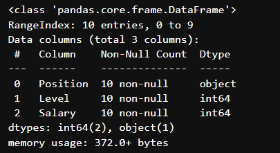
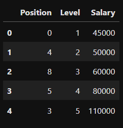

# Implementation-of-Decision-Tree-Regressor-Model-for-Predicting-the-Salary-of-the-Employee

## AIM:
To write a program to implement the Decision Tree Regressor Model for Predicting the Salary of the Employee.

## Equipments Required:
1. Hardware – PCs
2. Anaconda – Python 3.7 Installation / Jupyter notebook

## Algorithm
1. Import required libraries for data handling, preprocessing, modeling, and evaluation.
2. Load the dataset from the CSV file into a pandas DataFrame.
3. Check for null values and inspect data structure using .info() and .isnull().sum().
4. Encode the categorical "Position" column using LabelEncoder.
5. Split features (Position, Level) and target (Salary), then divide into training and test sets.
6. Train a DecisionTreeRegressor model on the training data.
7. Predict on test data, calculate mean squared error and R² score, and make a sample prediction. 

## Program:
```
/*
Program to implement the Decision Tree Regressor Model for Predicting the Salary of the Employee.
Developed by: Nanda Kishor S P
RegisterNumber: 212224040210
*/
```

```python
# importing the necessary libraries
import pandas as pd
from sklearn.preprocessing import LabelEncoder
from sklearn.model_selection import train_test_split
from sklearn.tree import DecisionTreeRegressor
from sklearn import metrics
```

```python
# load the dataframe
data = pd.read_csv("Salary.csv")
```

```python
# display head values
data.head()
```

```python
# display dataframe information
data.info()
```

```python
# display the count of null values
data.isnull().sum()
```

```python
# encode postion using label encoder
le = LabelEncoder()
data["Position"] = le.fit_transform(data["Position"])
data.head()
```

```python
# defining x and y and splitting them
x = data[["Position", "Level"]]
y = data["Salary"]
x_train, x_test, y_train, y_test = train_test_split(x, y, test_size=0.2)
```

```python
dt = DecisionTreeRegressor()
dt.fit(x_train, y_train)
```

```python
# predicting test values with model
y_pred = dt.predict(x_test)
```

```python
mse = metrics.mean_squared_error(y_test, y_pred)
mse
```

```python
r2 = metrics.r2_score(y_test, y_pred)
r2
```

```python
dt.predict(pd.DataFrame([[5,6]], columns=["Position", "Level"]))
```

## Output:

### Head Values
  

### DataFrame info
  

### Null Count
  

### Encoding Position Feature
  

### Training the Model
  

### Mean Square Error
  

### R2 Score
  

### Final Prediction on Untrained Data
  


## Result:
Thus the program to implement the Decision Tree Regressor Model for Predicting the Salary of the Employee is written and verified using python programming.
